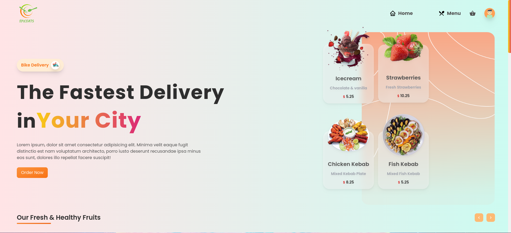
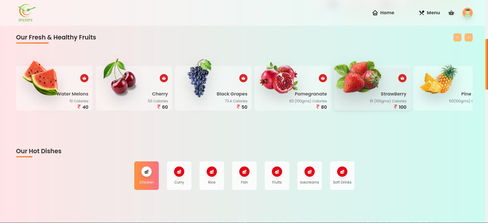
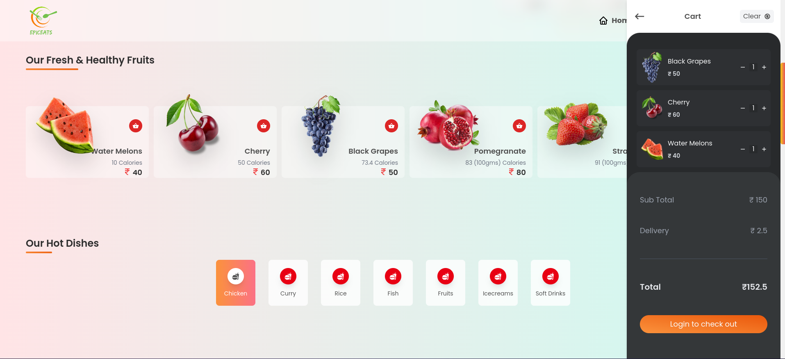
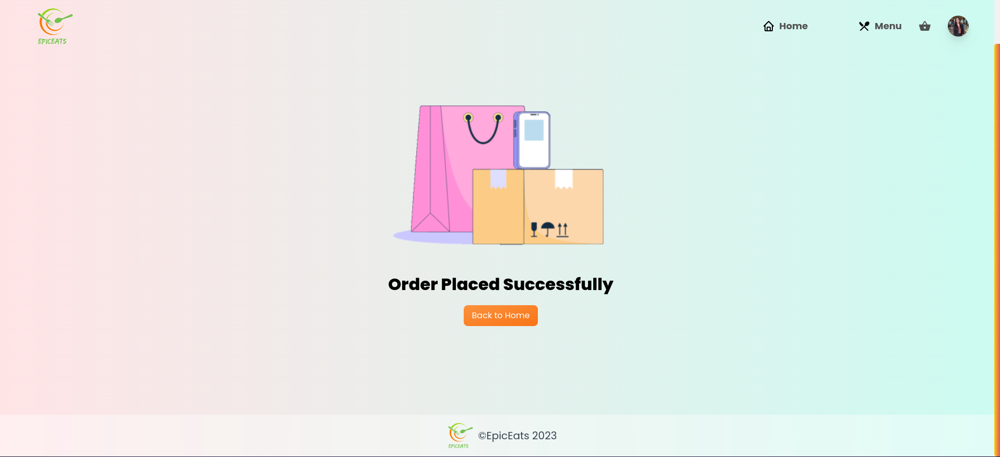

# Welcome to EpicEats !

## A Food Ordering App

This is a Food ordering app build with React Js with latest Modern UI with tailwind css. This app has a modern clear and user friendly user interface. It has Google Authentication. Firebase Database. 

# Technologies 👇

## React 🔥

## Context Api 🔥

## React Router Dom 🔥

## Tailwind CSS🔥

## Firebase

## Google Authentication with Firebase

## Demo 🔥

<a href="https://epic-eats-food.netlify.app/" target="_blank">Live Demo</a>

## Available Scripts 🔥

In the project directory, you can run:

### `Clone the repo`

### `npm install`

### `npm start`

## Preview Home

## Preview Product

## Preview Cart

## Preview Order Placed

